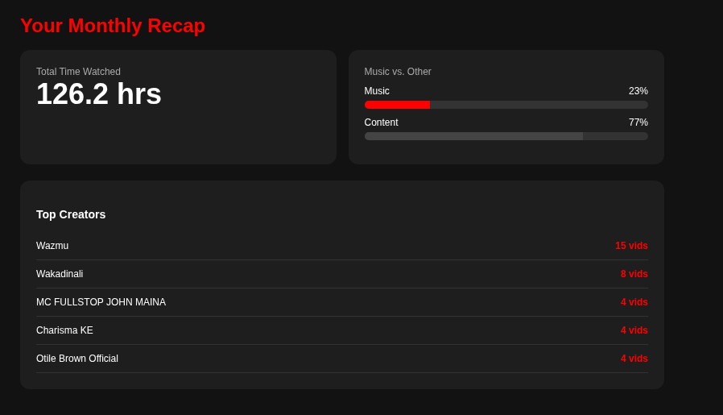

# TubeWeekly 📊

**TubeWeekly** is a Chrome Extension that generates a "Spotify Wrapped"-style recap for your YouTube watch history. Instead of waiting for a yearly summary, get insights into your viewing habits **any time you want**.

> **Note:** This project does **not** use the official YouTube API (which restricts watch history access). Instead, it uses a smart, client-side scraping engine to analyze your history locally on your machine.

## 🚀 Features

* **On-Demand Recap:** Analyze your last ~28 days of watch history instantly.
* **Top Creators:** See which channels you interact with the most.
* **Music vs. Content:** Automatically categorizes videos to distinguish between music streaming and video watching.
* **Hours Watched:** Calculates your total watch time based on video timestamps.
* **Cross-Device Sync:** Captures history from your Phone, TV, and Tablet (via your synced Google Account history).
* **Privacy First:** All data is processed **locally** in your browser. No data is sent to external servers.

## 🛠️ How It Works (Technical)

Since the YouTube API does not provide access to user history, TubeWeekly uses a "Ghost Tab" technique:

1.  **Ghost Tab:** When triggered, the extension opens `youtube.com/feed/history` in a hidden background process.
2.  **Auto-Scroll Engine:** A content script simulates user scrolling to trigger YouTube's "Infinite Scroll" and load older data.
3.  **Smart Scraping:** It parses the DOM to extract Video Titles, Channel Names, and Durations.
    * *Includes specific support for YouTube's modern `yt-lockup-view-model` UI architecture.*
4.  **Dashboarding:** The raw data is passed to a local HTML dashboard (`recap.html`) for visualization and categorization.

## 📦 Installation

To use this extension, load it as an "Unpacked Extension" in Chrome:

1.  Clone or download this repository to your computer.
2.  Open Chrome and navigate to `chrome://extensions`.
3.  Toggle **Developer mode** in the top right corner.
4.  Click **Load unpacked**.
5.  Select the folder containing these files (`manifest.json`, `background.js`, etc.).
6.  Pin the extension to your toolbar and click "Get My Recap"!

## 📂 Project Structure

* `manifest.json` - Configuration and permissions (Manifest V3).
* `background.js` - The core engine. Handles the background tab, auto-scrolling, and HTML parsing.
* `recap.html / recap.js` - The frontend dashboard that displays the charts and statistics.
* `popup.html / popup.js` - The minimalist entry point for the extension.

## 📝 Future Roadmap

* [ ] Add "Genre" detection for music videos.
* [ ] Allow users to download their stats card as an image.
* [ ] Add a date picker to choose custom time ranges.

## ⚠️ Disclaimer

This is a personal project built for educational purposes. It is not affiliated with or endorsed by YouTube or Google. The scraping logic relies on YouTube's DOM structure, which may change over time.
